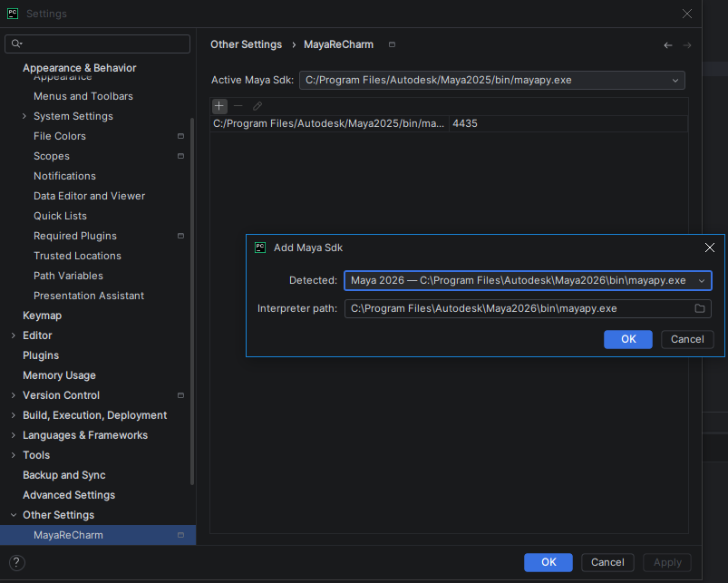
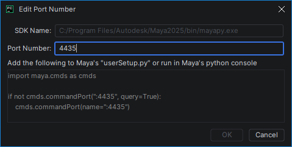
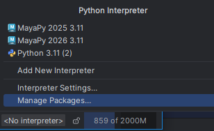
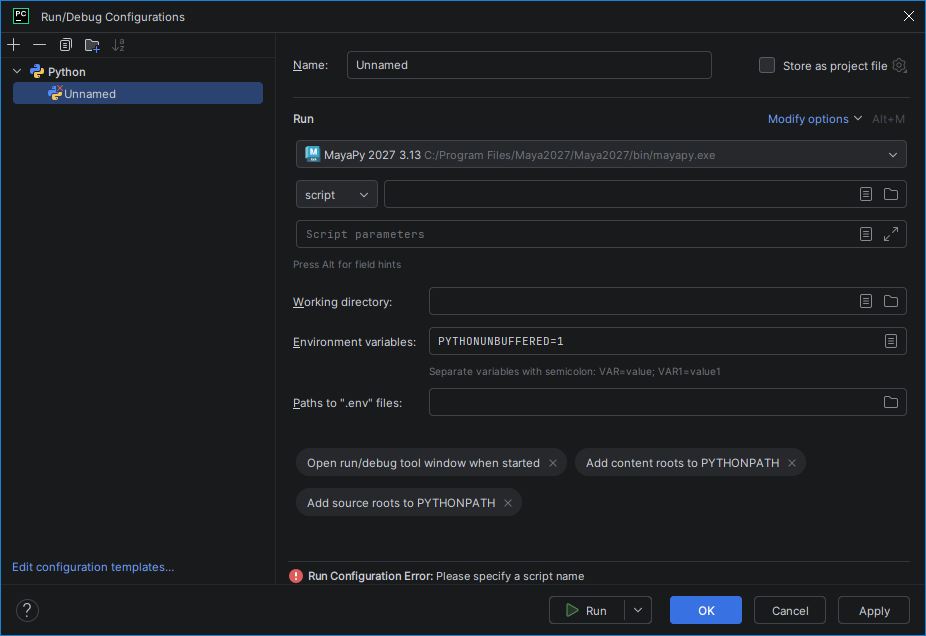
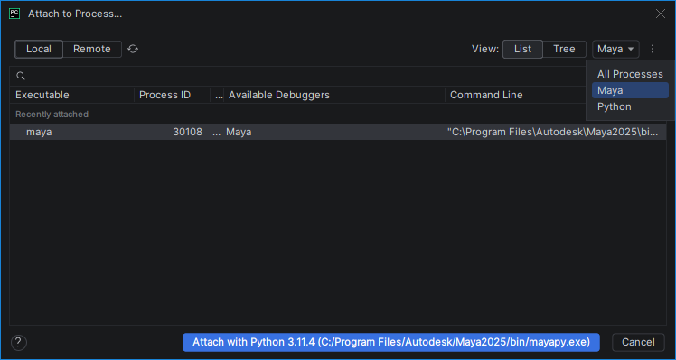
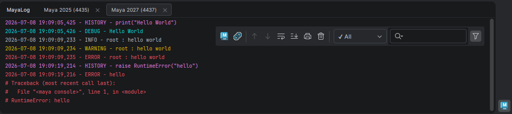

# MayaReCharm

<!-- Plugin description -->
Maya integration for PyCharm. MayaReCharm lets you execute the current document or arbitrary code directly in Maya, and
allows attaching the PyDev debugger to a running Maya instance.
<!-- Plugin description end -->

> [!NOTE]
> For those looking for the compiled version, you can find it in the **[JetBrains Marketplace](https://plugins.jetbrains.com/plugin/31239-mayarecharm/)** or install it directly from your IDE's plugin manager.

> [!TIP]
> If you need older versions, you can find them in the original [MayaCharm repository](https://github.com/cmcpasserby/MayaCharm) by Chris Cunningham.

## 🥰 Support My Work

If you appreciate my work, consider ⭐ starring this repository or 💰 making a donation to support
future updates and maintenance.

## Installation

MayaReCharm requires some minimal setup. The settings panel is located at `Settings | Other Settings | MayaReCharm`.

- **Port Numbers:** Define the port numbers MayaReCharm will use to communicate with your Maya installations.
- **Maya Interpreters:** Add `mayapy` interpreters to make them available for code execution. 

> [!WARNING]
> Adding `mayapy` via the standard `Settings | Python Interpreter` is not supported.

When editing a port number, MayaReCharm displays the code required to open Maya for connections. You can execute this
code in Maya or add it to your `userSetup.py` file.

## Usage

Once configured, `mayapy` interpreters are available as Python Interpreter. Select one of them through the bottom-right
interpreter selector in the IDE so you can enjoy proper syntax highlighting and code completion for Maya's Python API,
this will also determine to which Maya `Execute Actions` will send the code.

Maya interpreters can also be used in `Run Configurations`. The script will be executed by a new standalone `mayapy`
process.
In this specific case, `maya.cmds` will require an initialization as
explained [here](https://help.autodesk.com/view/MAYAUL/2027/ENU/?guid=GUID-D457D6A0-1E7F-4ED2-B0B4-8B57153B563B)

### Actions

MayaReCharm provides two main actions in the `Run` menu, which can also be accessed via keyboard shortcuts:

- **Execute Document (`Alt+A`):** Sends the entire current file to Maya.
- **Execute Selection (`Alt+S`):** Sends only the selected code to Maya.

### Debugging

Debugging via Run Configurations is no longer supported due to reliability issues. However, you can use the standard
`Run | Attach to Process...` command. MayaReCharm ensures Maya instances are correctly identified in the
process list, allowing you to attach the local PyDev debugger.

### Logging

MayaReCharm provides a logging console that captures output from Maya. You can access it via
`View | Tool Windows | MayaLog` or by the Maya icon in the left tool window bar.

The console supports one tab for each configured Maya interpreter, allowing you to view logs from multiple versions of
Maya simultaneously. It also supports search and log level filtering.

The  button in the console toolbar is a
shortcut for the `Execute Document` action with a small twist. It will send the current file to the Maya
instance associated with the focused tab, even if the current project interpreter does not match.

The   button in the console toolbar is the new
location of the `Connect to Maya's log` action. It will try to connect to your Maya instance that matches the current
tab.
If the connection is successful, you'll see the message `PyCharm logger initialized and callback registered.` both in
the console (`INFO` level) and in the Maya script editor.
If nothing happens, try closing the tab and reopening it, or check the log level filter to ensure `INFO` level messages
are visible.