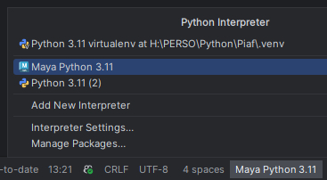
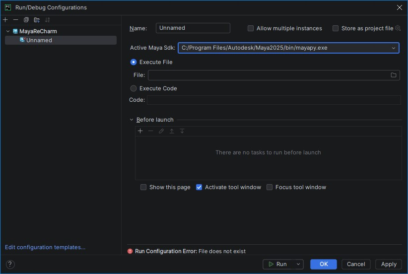

# MayaReCharm

<!-- Plugin description -->
Maya integration for PyCharm. MayaReCharm lets you execute the current document or arbitrary code directly in Maya, and
allows attaching the PyDev debugger to a running Maya instance.
<!-- Plugin description end -->

For those looking for the compiled version, you can find it in the JetBrains Marketplace:
[https://plugins.jetbrains.com/plugin/31239-mayarecharm/](https://plugins.jetbrains.com/plugin/31239-mayarecharm/)

## Installation

MayaReCharm requires some minimal setup. The settings panel is located at `Settings | Other Settings | MayaReCharm`.

- **Port Numbers:** Define the port numbers MayaReCharm will use to communicate with your Maya installations.
- **Active Maya SDK:** Set the Maya installation used for the `Execute Document` and `Execute Selection` actions.
- **Maya Interpreters:** Add `mayapy` interpreters to make them available for code execution. Note that adding `mayapy`
  via the standard `Settings | Python Interpreter` is not supported.

When editing a port number, MayaReCharm displays the code required to open Maya for connections. You can execute this
code in Maya or add it to your `userSetup.py` file.

## Usage

Once configured, mayapy interpreters are available as Python Interpreter. You can select them through the bottom-right
interpreter selector in the IDE.

MayaReCharm also adds a new type of Run Configuration. Select the Maya instance to connect to and provide a Python file
or specific code to execute.

### Actions

MayaReCharm provides two main actions in the `Run` menu, which can also be accessed via keyboard shortcuts:

- **Execute Document (`Alt+A`):** Sends the entire current file to Maya.
- **Execute Selection (`Alt+S`):** Sends only the selected code to Maya.

### Debugging

Debugging via Run Configurations is no longer supported due to reliability issues. However, you can use the standard
`Run | Attach to Process...` command. MayaReCharm ensures Maya instances are correctly identified in the
process list, allowing you to attach the local PyDev debugger.

